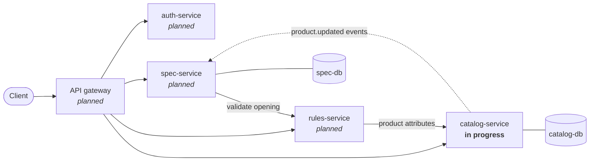

# DoorSpec

DoorSpec helps an architectural hardware spec writer assemble **door openings** (a door plus its locks, hinges, closers, exit devices, and power supplies) and check each one against building and life-safety code requirements, such as "a fire-rated door requires a closer" (NFPA 80) or "an electrified lock needs a power supply on the opening."

It's built as a small set of Python microservices with FastAPI, Postgres, and Docker, to explore API design, service-to-service communication, and API security end to end.

> **Status:** in progress. `catalog-service` is under active development; the other services are planned. See [Roadmap](#roadmap).

## Architecture



| Service | Owns | Status |
|---|---|---|
| **catalog-service** | Door hardware products and their attributes (category, fire rating, electrified, voltage, finish) | In progress |
| **rules-service** | Code-compliance rules; validates a proposed opening and returns violations | Planned |
| **spec-service** | Projects, openings, and versioned spec revisions | Planned |
| **auth-service** | Users and JWT issuance (RS256, JWKS) | Planned |

Each service owns its own database, and no service reads another's tables. Services communicate only through their HTTP APIs and events.

## Getting started

### Prerequisites

- **[Docker](https://docs.docker.com/get-docker/)** with Compose v2
- **[uv](https://docs.astral.sh/uv/getting-started/installation/)**, which also installs the right Python version (3.14) automatically
- **[pre-commit](https://pre-commit.com/)** (recommended): `uv tool install pre-commit`

Port **5432** must be free for the database container. If a local Postgres is running, stop it first.

### Run catalog-service

```bash
git clone git@github.com:jsturtz/doorspec.git
cd doorspec
pre-commit install                 # lint and format on every commit

docker compose up -d --wait        # start Postgres and wait until it's healthy

cd catalog-service
cp .env.example .env               # local dev settings; .env is gitignored
uv sync                            # create .venv and install locked dependencies
uv run alembic upgrade head        # apply database migrations
uv run uvicorn app.main:app --reload
```

Then check it:

- Interactive API docs: <http://localhost:8000/docs>
- Readiness (confirms the database connection): `curl localhost:8000/health/ready` → `{"status":"ready"}`

## API

catalog-service **v0.3.0**, with interactive docs at `/docs` once running. Changes and migration notes are in [catalog-service/CHANGELOG.md](catalog-service/CHANGELOG.md); compatibility rules are in [decision 14](docs/decisions.md#14-api-versioning-and-breaking-change-policy).

| Method | Path | Success | Errors |
|---|---|---|---|
| `GET` | `/health/` | 200 (process is up) | |
| `GET` | `/health/ready` | 200 (database reachable) | 503 |
| `POST` | `/products` | 201 + product | 409 duplicate SKU · 422 invalid |
| `GET` | `/products?category=&fire_rated=&limit=&cursor=` | 200 + page: `{items, next_cursor}` | 400 invalid cursor · 422 invalid filter |
| `GET` | `/products/{id}` | 200 + product | 404 |
| `PATCH` | `/products/{id}` | 200 + product (only sent fields change) | 404 · 409 · 422 |
| `PUT` | `/products/{id}` | 200 + product (full replacement) | 404 · 409 · 422 |
| `DELETE` | `/products/{id}` | 204 | 404 |

## Development

All commands run from `catalog-service/` unless noted.

| Task | Command |
|---|---|
| Run the tests (needs the database container running) | `uv run pytest` |
| Lint and format everything (repo root) | `pre-commit run --all-files` |
| Create a migration after changing `app/models.py` | `uv run alembic revision --autogenerate -m "describe the change"` |
| Apply migrations | `uv run alembic upgrade head` |
| Roll back the last migration | `uv run alembic downgrade -1` |
| Open a psql shell (repo root) | `docker compose exec catalog-db psql -U catalog` |
| Stop the database, keeping its data (repo root) | `docker compose down` |
| Reset the database completely (repo root) | `docker compose down -v` |

**Always read an autogenerated migration before applying it.** Alembic can't tell a column rename from a drop and an add, and it misses some changes entirely. Commit each migration together with the model change it belongs to. See [decision 9](docs/decisions.md#9-schema-changes-through-alembic-migrations-run-as-a-deploy-step).

**Tests** run against a real Postgres database, `catalog_test`, created automatically on the same container and migrated with Alembic at the start of each run. Each test runs inside a transaction that is rolled back afterwards, so tests are isolated and the development database is never touched. See [decision 12](docs/decisions.md#12-api-tests-run-against-real-postgres-rolled-back-per-test).

**Configuration** comes from environment variables, falling back to the service's `.env`. `.env.example` lists every setting. See [decision 7](docs/decisions.md#7-configuration-from-the-environment-one-env-per-service).

### Project layout

```
doorspec/
├── docker-compose.yml        # local infrastructure (Postgres)
├── ruff.toml                 # shared lint/format rules for all services
├── .pre-commit-config.yaml
├── pyrightconfig.json        # editor import roots: one per service
├── docs/
│   ├── decisions.md          # design decisions and their rationale
│   └── n-plus-one.md         # N+1 query problem: measured and fixed
└── catalog-service/          # self-contained uv project
    ├── app/
    │   ├── main.py           # FastAPI app, health endpoints, router registration
    │   ├── config.py         # typed settings from env / .env
    │   ├── db.py             # engine, session factory, get_db dependency
    │   ├── domain.py         # enums and limits shared by models and schemas
    │   ├── pagination.py     # opaque cursors for keyset pagination
    │   ├── models.py         # SQLAlchemy ORM models (storage)
    │   ├── schemas.py        # Pydantic schemas (API contract)
    │   └── routers/          # HTTP endpoints by resource
    ├── alembic/              # database migrations
    ├── CHANGELOG.md          # release notes, including breaking changes
    └── tests/
```

### Troubleshooting

- **`port is already allocated` on `docker compose up`:** something else is using port 5432, usually a locally installed Postgres. Stop it (`sudo systemctl stop postgresql` on Linux).
- **`/health/ready` returns 503:** the database isn't reachable. Check `docker compose ps` and that `DATABASE_URL` in `.env` matches `.env.example`.
- **`ModuleNotFoundError: No module named 'psycopg2'`:** the `DATABASE_URL` scheme must be `postgresql+psycopg://` (psycopg 3), not `postgresql://`.

## Design decisions

The reasoning behind the architecture, including the alternatives considered and the trade-offs accepted, is in **[docs/decisions.md](docs/decisions.md)**. Highlights:

- [API schemas are separate from ORM models](docs/decisions.md#2-api-schemas-are-separate-from-orm-models)
- [Validate at the API edge and enforce in the database](docs/decisions.md#4-validate-at-the-api-edge-and-enforce-in-the-database)
- [Enums stored as VARCHAR + CHECK, not native Postgres ENUM](docs/decisions.md#5-enums-stored-as-varchar--check-not-native-postgres-enum)
- [Separate liveness and readiness endpoints](docs/decisions.md#8-separate-liveness-and-readiness-endpoints)
- [Cursor (keyset) pagination, not offset](docs/decisions.md#13-cursor-keyset-pagination-not-offset)
- [API versioning and breaking-change policy](docs/decisions.md#14-api-versioning-and-breaking-change-policy)
- [N+1 queries: measured (21 queries → 2) and guarded by tests](docs/n-plus-one.md)

## Roadmap

| Phase | Scope | Status |
|---|---|---|
| 1 | catalog-service: schemas, Postgres, migrations, CRUD, pagination, tests | In progress |
| 2 | rules-service: rules as data, HTTP calls to catalog, timeouts and retries, contract tests, correlation IDs | Planned |
| 3 | spec-service: database per service, Kafka events, versioned revisions, optimistic concurrency, idempotency keys | Planned |
| 4 | auth-service and gateway: JWT (RS256/JWKS), RBAC, object-level authorization, TLS, rate limiting | Planned |
| 5 | Containers and CI: Dockerfiles, full Compose stack, GitHub Actions, security scanning, end-to-end tests | Planned |
| 6 | Azure: Container Apps, Postgres Flexible Server, Event Hubs, Key Vault, managed identity, OpenTelemetry | Planned |
